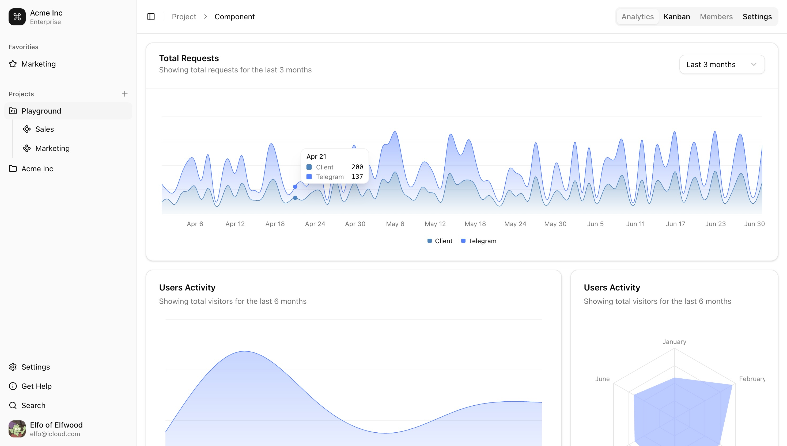
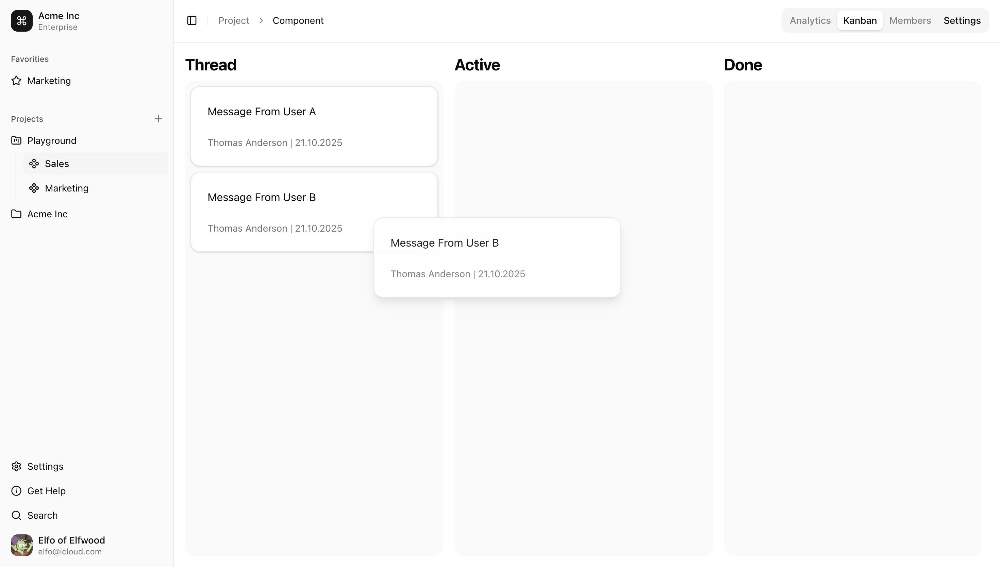

# KANBAN

[Web Page](https://project-2-bf0db.web.app/)

## Description
A project management application designed to provide project owners with clear analytics, managers with convenient task management, and team members with an easy way to submit requests through their favorite messenger.

## Features
- Complex project architecture including server, database, client, integrations and firebase
- Nested board and component structure for scalable kanban workflows
- Integration with messengers for creating task cards
- Real-time feedback in the messenger when task status changes in the app
- Comprehensive analytics for projects, components, and users

## Technologies
- **Front-End:** HTML, CSS, Typescript, React, Redux
- **UI Library:** Shadcn, Tailwind, DnD Kit
- **Back-End:** Node, Express, Postgre, Firebase Auth
- **Integration:** Telegram, Web Socket
- **Hosting:** Firebase Hosting, Render

## Installation
The project is currently frozen and no longer actively maintained.
